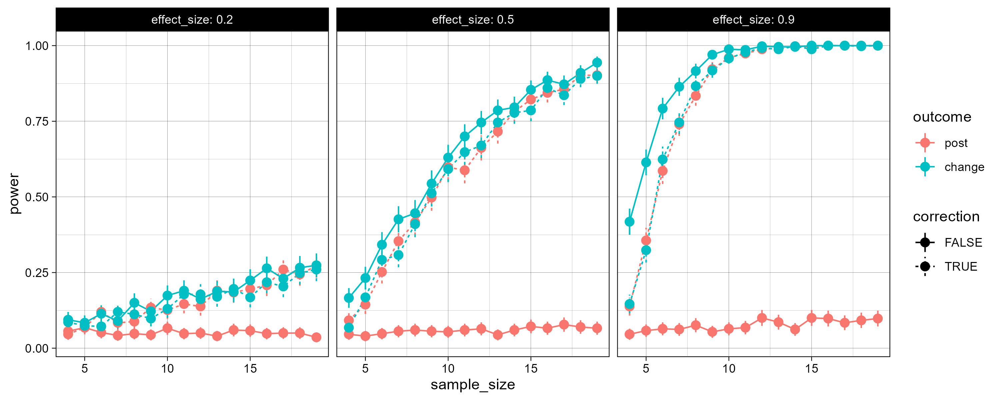

# Tidy simulation in R


Example code repository accompanying the manuscript _Tidy simulation: Designing robust, reproducible, and scalable Monte Carlo simulations._ 

Project management for this repository is done via an [RStudio project](https://r4ds.hadley.nz/workflow-scripts.html#projects)


## Installation and usage

1. Install [R](https://www.r-project.org/) and [RStudio](https://posit.co/download/rstudio-desktop/)
2. Download or clone this repository
3. Open the project `tidy_simulation.Rproj` in RStudio
4. Install the dependencies from within R: 
   ```R
   install.packages(c("tidyverse", "nanoparquet", "pbapply"))
   ```
6. Run the simulation by running the code in either `01_tidy_simulation.R` or (for the parallel version) `01b_tidy_simulation_parallel.R`
7. Run the analyses using `02_tidy_analysis.R`.
8. Admire the images in the `img/` subfolder!



