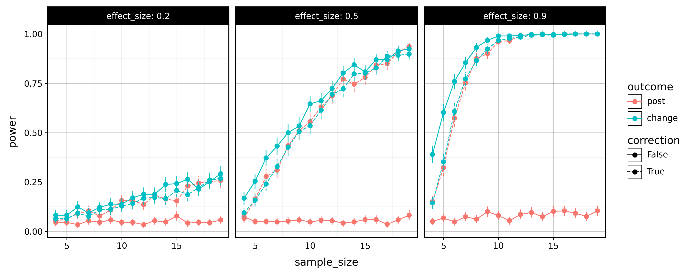

# Tidy simulation in python

 

Example code repository accompanying the manuscript _Tidy simulation: Designing robust, reproducible, and scalable Monte Carlo simulations._ 

Project and dependency management for this repository is done via the excellent [uv](https://docs.astral.sh/uv/) project manager.

## Installation and usage

1. Install [uv](https://docs.astral.sh/uv/)
2. Download or clone this repository
3. From the base folder of this repository, run `uv sync` to install the dependencies.
4. Run the simulation using either `uv run 01a_tidy_simulation.py` or (for the parallel version) `uv run 01b_tidy_simulation_parallel.py`
5. Run the analyses using `uv run 02_tidy_analysis.py`.
6. Admire the images in the `img/` subfolder!

